<div align="center">

# Hi, I'm Mohtasim Dipto 👋

<a href="https://git.io/typing-svg"></a>

### Software Engineering Student & Full-Stack Developer

I design and develop reliable, user-focused web applications using modern frameworks and clean UI/UX principles.

[](https://my-official-portfolio-nine.vercel.app/)
[](https://www.linkedin.com/in/mohtasim-dipto/)
[](mailto:dipto.np124@gmail.com)
[](https://github.com/Dipto6969)

</div>

---

## 💼 About Me

<div align="center">

```ascii
╔═══════════════════════════════════════════════════════════════════════════════╗
║                                                                               ║
║     ███╗   ███╗ ██████╗ ██╗  ██╗████████╗ █████╗ ███████╗██╗███╗   ███╗    ║
║     ████╗ ████║██╔═══██╗██║  ██║╚══██╔══╝██╔══██╗██╔════╝██║████╗ ████║    ║
║     ██╔████╔██║██║   ██║███████║   ██║   ███████║███████╗██║██╔████╔██║    ║
║     ██║╚██╔╝██║██║   ██║██╔══██║   ██║   ██╔══██║╚════██║██║██║╚██╔╝██║    ║
║     ██║ ╚═╝ ██║╚██████╔╝██║  ██║   ██║   ██║  ██║███████║██║██║ ╚═╝ ██║    ║
║     ╚═╝     ╚═╝ ╚═════╝ ╚═╝  ╚═╝   ╚═╝   ╚═╝  ╚═╝╚══════╝╚═╝╚═╝     ╚═╝    ║
║                                                                               ║
║                   Software Engineering Student & Developer                   ║
║                                                                               ║
╚═══════════════════════════════════════════════════════════════════════════════╝
```

</div>

<table>
<tr>
<td width="50%" valign="top">

### 🎓 Profile

```yaml
name: Mohtasim Dipto
role: Full-Stack Developer
education: |
  BSc in Software Engineering
  Islamic University of Technology
location: Dhaka, Bangladesh 🇧🇩
experience: 3+ years (University Projects)
status: Open to opportunities
```

### 🎯 Core Strengths

```diff
+ Problem Solving & Analytical Thinking
+ Creative & Innovative Approach
+ Efficient Time Management
+ Collaborative Team Player
+ Quick Learner & Adaptable
```

</td>
<td width="50%" valign="top">

### 🚀 Current Focus

```javascript
const currentlyWorking = {
  learning: [
    "🤗 Hugging Face Transformers",
    "🧪 Google Colab & ML Pipelines",
    "🤖 AI/ML Integration in Web Apps"
  ],
  building: [
    "📱 Scalable Full-Stack Applications",
    "☁️ Cloud-Native Solutions",
    "🎨 Modern UI/UX Experiences"
  ],
  exploring: [
    "🔮 Advanced System Design",
    "⚡ Performance Optimization",
    "🐳 DevOps & Containerization"
  ]
};
```

### 💡 Passion Areas

```python
passions = {
    'web_dev': ['React', 'Next.js', 'Node.js'],
    'cloud': ['Azure', 'Serverless', 'Microservices'],
    'design': ['UI/UX', 'Responsive', 'Accessibility'],
    'fun_fact': '🎬 Cinema polyglot - 30+ languages!'
}
```

</td>
</tr>
</table>

<div align="center">

### 📊 What I Do Daily

```mermaid
mindmap
  root((Mohtasim 😌))
    🌴
      🎧
    💻 Coding
      Building Cool Projects
      Web & Mobile Apps
      Learning New Tech
      Solving Bugs 🐛
    🎬 Entertainment
      Movies 🍿
      TV Series 📺
      Anime 🎌
    🎮 Gaming
      PC Games
      Casual Mobile Games
      Multiplayer with Friends
    🧠 Growth
      Exploring Ideas
      Improving Skills
      Trying New Things
    🤝 Social
      Friends & Community
      Open Source
      Team Collaboration
```



</div>

<div align="center">

### 🔥 Quick Stats

| 🎯 Focus | 💼 Expertise | 🌟 Approach |
|:--------:|:------------:|:-----------:|
| **AI/ML Integration** | **Full-Stack Development** | **User-Centric** |
| Learning Transformers | MERN + Next.js Stack | Design First |
| Google Colab Projects | Cloud Computing | Scalable Solutions |
| Model Fine-tuning | RESTful APIs | Clean Code |

</div>

---

<div align="center">

### 📬 Let's Connect

[](mailto:dipto.np124@gmail.com)
[](tel:+8801671942845)

```typescript
// Current Status
const status = {
    code: "Turning coffee into code ☕",
    learning: "Always exploring new tech 🚀",
    collaboration: "Open for interesting projects 🤝",
    availability: "Ready to build something amazing! ✨"
};
```

</div>

---

## 🛠️ Technical Skills

<table>
<tr>
<td width="25%" align="center">

### Languages


</td>
<td width="25%" align="center">

### Web & Backend


</td>
<td width="25%" align="center">

### Databases


</td>
<td width="25%" align="center">

### Tools & Platforms


</td>
</tr>
</table>

---

## 🚀 Featured Projects

<table>
<tr>
<td width="50%">

### 🎓 [Learnify](https://github.com/Dipto6969/Learnify)

**Learning Platform for Students & Educators**  
*Oct 2024 – Dec 2024*

Full-stack web platform designed for seamless learning experiences and efficient course management.

**Tech Stack:**  
`Next.js` `Tailwind CSS` `Node.js` `Express.js` `PostgreSQL` `Stripe`

**Key Features:**
- ✅ Developed full-stack platform for course enrollment and progress tracking
- ✅ Implemented secure payment processing via Stripe
- ✅ Dynamic dashboards for students, teachers, and admins
- ✅ Media uploads and chapter-wise progress tracking

</td>
<td width="50%">

### 🚔 [Police-Positive](https://github.com/Dipto6969)

**Bridging Citizens and Police with Transparency**  
*July 2025 – September 2025*

Smart dashboard connecting civilians, police operators, and supervisors for efficient crime reporting and management.

**Tech Stack:**  
`React.js` `Node.js` `Express.js` `MongoDB` `Tailwind CSS`

**Key Features:**
- ✅ Real-time incident reporting with AI-driven chatbot for GD/FIR
- ✅ Operator alerts for crimes and emergencies
- ✅ Supervisor tools with performance metrics and corruption detection
- ✅ Evidence uploads, case tracking, and anonymous reporting

</td>
</tr>

<tr>
<td width="50%">

### 💬 [Chat-App](https://github.com/Dipto6969/CHAT-APP)

**Real-Time Messaging Application**  
*Aug 2024 – Sept 2024*

Built a real-time chat application featuring instant messaging and user presence tracking with modern web technologies.

**Tech Stack:**  
`MERN Stack` `Socket.IO` `JWT` `WebSocket`

**Key Features:**
- ✅ Real-time messaging with Socket.IO
- ✅ JWT-based secure authentication
- ✅ User presence and typing indicators
- ✅ Message history and instant notifications

</td>
<td width="50%">

### 📝 [Examination Management System](https://github.com/Dipto6969/Examination-Management-System)

**Enterprise Exam Management**  
*Nov 2023 – Dec 2023*

Comprehensive role-based platform to manage exam schedules, records, and automated result generation.

**Tech Stack:**  
`Java` `PostgreSQL` `PL/pgSQL` `Maven/Gradle`

**Key Features:**
- ✅ Automated grade calculation system
- ✅ Conflict-free exam scheduling logic
- ✅ Secure admin dashboard with role management
- ✅ Comprehensive result analytics and reports

</td>
</tr>

<tr>
<td width="50%">

### 🌤️ [Console Weather App](https://github.com/Dipto6969/FindWeather)

**CLI Weather Application**  
*Jan 2025 – Feb 2025*

Smart command-line weather app with multiple API integrations and intelligent fallback mechanisms.

**Tech Stack:**  
`Java` `OpenWeatherMap` `WeatherStack` `IpStack APIs` `ipify`

**Key Features:**
- ✅ Fetch weather data using IP or city name
- ✅ Multiple API integration with intelligent fallback
- ✅ Caching mechanism for improved performance
- ✅ Rate limiting for smooth API usage

</td>
<td width="50%">

### 🎬 [MovieTracker](https://github.com/Dipto6969/MovieTracker)

**Personal Movie Management**

A modern application to track, rate, and organize your movie watching experience with an elegant interface.

**Tech Stack:**  
`TypeScript` `React` `Next.js`

**Key Features:**
- ✅ Personal movie collection management
- ✅ Rating and review system
- ✅ Advanced search and filtering options
- ✅ Responsive modern UI with smooth animations

</td>
</tr>
</table>

---

## 📊 GitHub Statistics

<div align="center">

<!-- GitHub Stats Card -->
<!-- GitHub Stats (Fast) -->


<!-- GitHub Streak Stats (Demo) -->
<!-- Streak (Demo) -->

<!-- Contribution Graph -->


<!-- Additional Stats -->


</div>

---

## 🏆 Achievements & Certifications

<div align="center">

### 📜 Responsive Web Design Certification
**freeCodeCamp** | [View Certificate](https://www.freecodecamp.org/certification)

Learned HTML, CSS, Flexbox, Grid, and responsive design best practices through comprehensive hands-on projects.

---

### 🎯 Extracurricular Activities

**IUT Computer Society – Volunteer**  
Coordinated participant transportation and guided attendees during tech fest events, ensuring smooth logistical flow and enhanced participant experience.

</div>

---

## 🎯 Current Focus & Goals

```javascript
const currentGoals2025 = {
    learning: [
        "Machine Learning with Hugging Face 🤗",
        "Advanced AI Integration & LLMs",
        "Cloud Computing & DevOps",
        "System Design & Architecture"
    ],
    building: [
        "AI-powered web applications",
        "Scalable microservices",
        "Real-time collaborative tools"
    ],
    exploring: [
        "Serverless Architecture",
        "Container Orchestration",
        "Performance Optimization"
    ]
};

console.log("Always open to collaborate on innovative projects! 🚀");
```

---

## 📫 Let's Connect & Collaborate

<div align="center">

I'm always interested in connecting with fellow developers, discussing new technologies, or collaborating on interesting projects. Feel free to reach out!

<br/>

[](mailto:dipto.np124@gmail.com)
[](https://my-official-portfolio-nine.vercel.app/)
[](https://www.linkedin.com/in/mohtasim-dipto/)
[](tel:+8801671942845)

</div>

---

---

**✨ Thanks for visiting my profile! Let's build something amazing together. ✨**


</div>
